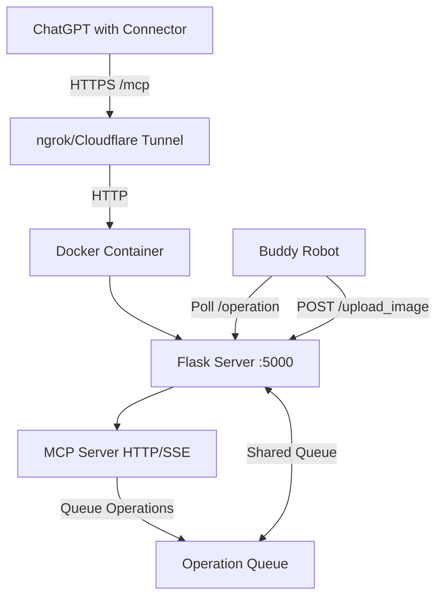

# Buddy Robot MCP Server

A Model Context Protocol (MCP) server for controlling the Buddy robot through ChatGPT connectors or Claude Desktop. This Flask-based application provides an HTTP API and MCP interface for robot operations including movement, speech, mood changes, head movements, and camera access.

## Features

- **Movement Control**: Move Buddy forward/backward and rotate left/right
- **Speech Synthesis**: Make Buddy speak with adjustable volume
- **Mood Display**: Change Buddy's facial expressions
- **Head Movements**: Nod (yes) or shake (no) head
- **Camera Access**: Capture and retrieve images from Buddy's camera
- **Multiple Modes**: 
  - HTTP/SSE mode for ChatGPT connectors (Docker)
  - stdio mode for Claude Desktop
  - CLI mode for local testing

## Architecture



## Quick Start with Docker

### Prerequisites

- Docker and Docker Compose installed
- ngrok or Cloudflare Tunnel (for exposing to ChatGPT)

### 1. Build and Run with Docker Compose

```bash
# Build and start the container
docker-compose up -d

# View logs
docker-compose logs -f

# Stop the container
docker-compose down
```

### 2. Alternative: Build and Run with Docker

```bash
# Build the image
docker build -t buddy-mcp-server .

# Run the container
docker run -d -p 5000:5000 --name buddy-server buddy-mcp-server

# View logs
docker logs -f buddy-server

# Stop the container
docker stop buddy-server
docker rm buddy-server
```

### 3. Expose with ngrok

```bash
# Install ngrok: https://ngrok.com/download
# Then expose your local port 5000
ngrok http 5000
```

This will provide a public HTTPS URL like `https://abc123.ngrok-free.app`

### 4. Create ChatGPT Connector

1. In ChatGPT, navigate to **Settings** → **Connectors** → **Create**
2. Fill in the details:
   - **Connector name**: Buddy Robot Controller
   - **Description**: Control and interact with Buddy robot - move, speak, change moods, take pictures
   - **Connector URL**: `https://your-ngrok-url.ngrok-free.app/mcp`
3. Click **Create**
4. You should see a list of available tools if the connection succeeds

### 5. Use in ChatGPT

1. Start a new chat in ChatGPT
2. Click the **+** button and select your Buddy Robot connector
3. Ask ChatGPT to control Buddy, for example:
   - "Move Buddy forward 1 meter"
   - "Make Buddy say hello"
   - "Change Buddy's mood to happy"
   - "Take a picture with Buddy's camera"

## Local Development

### Setup

```bash
# Create virtual environment
python -m venv .venv

# Activate virtual environment
# Windows:
.venv\Scripts\activate
# Linux/Mac:
source .venv/bin/activate

# Install dependencies
pip install -r requirements.txt
```

### Running Modes

#### HTTP/SSE Mode (for ChatGPT connectors)

```bash
python api.py --http
```

Server runs on `http://0.0.0.0:5000` with MCP endpoint at `/mcp`

#### stdio Mode (for Claude Desktop)

```bash
python api.py
```

Add to Claude Desktop config (`claude_desktop_config.json`):

```json
{
    "mcpServers": {
        "buddy-robot": {
            "command": "path/to/python",
            "args": ["path/to/api.py"],
            "description": "Control Buddy robot"
        }
    }
}
```

#### CLI Mode (for local testing)

```bash
python api.py --cli
```

Interactive command-line interface for testing Buddy operations.

Available CLI commands:
```
move <speed> <distance>     Move forward/backward (distance: + forward, - backward)
rotate <speed> <angle>      Rotate (angle: + right, - left)
speak <message>             Make Buddy speak (use quotes for multi-word)
speak <message> <volume>    Speak with specific volume (100-500)
head <yes|no>               Nod (yes) or shake (no) head
mood <mood>                 Set mood (happy, sad, angry, surprised, neutral, afraid, disgusted, contempt)
picture                     Show latest picture info
queue                       Show current operation queue
help                        Show help
quit                        Exit CLI
```

## API Endpoints

### Robot Control Endpoints

#### `POST /upload_image`

Upload an image from Buddy's camera.

**Request Body:**
```json
{
    "image_base64": "base64-encoded-image-data"
}
```

**Response:**
```json
{
    "status": "success",
    "message": "Image reçue avec succès"
}
```

#### `GET /operation`

Poll for the next operation in the queue (used by Buddy robot).

**Response:**
```json
{
    "status": "success",
    "operation": {
        "type": "MoveOperation",
        "speed": 100,
        "distance": 1.0
    }
}
```

Or if queue is empty:
```json
{
    "status": "success",
    "operation": null
}
```

### MCP Endpoints

#### `GET/POST /mcp`

Main MCP endpoint for ChatGPT connector integration via SSE transport.

#### `POST /mcp/messages`

Message endpoint for MCP SSE transport (receives messages from ChatGPT).

## MCP Tools

The server exposes the following tools through the MCP protocol:

### `move_buddy`

Move Buddy forward or backward.

**Parameters:**
- `speed` (number, 0-500): Movement speed (recommended: 50-200)
- `distance` (number): Distance in meters (positive = forward, negative = backward)

### `rotate_buddy`

Rotate Buddy left or right.

**Parameters:**
- `speed` (number, 0-500): Rotation speed (recommended: 50-200)
- `angle` (number): Angle in degrees (positive = right, negative = left)

### `speak`

Make Buddy say something out loud.

**Parameters:**
- `message` (string): Text to speak
- `volume` (integer, 100-500, default 300): Volume level

### `move_head`

Make Buddy nod or shake head.

**Parameters:**
- `axis` (string): "yes" for nod, "no" for shake
- `speed` (number, 0-100, default 40): Movement speed
- `angle` (number, 0-90, default 20): Movement angle

### `set_mood`

Change Buddy's facial expression.

**Parameters:**
- `mood` (string): One of: happy, sad, angry, surprised, neutral, afraid, disgusted, contempt

### `take_picture`

Capture and return the latest image from Buddy's camera.

**Parameters:** None

**Returns:** Image with timestamp

## Configuration

### Environment Variables

- `PYTHONUNBUFFERED=1`: Ensures Python output is sent straight to terminal without buffering

### Volumes

When using Docker Compose, the `./data` directory is mounted to persist image storage:

```yaml
volumes:
  - ./data:/app/data
```

### Ports

- **5000**: Flask server (HTTP API + MCP endpoint)

## Troubleshooting

### Container won't start

```bash
# Check container logs
docker-compose logs -f

# Or for docker run
docker logs -f buddy-server
```

### MCP endpoint returns 500 error

1. Ensure MCP package is installed: `pip install mcp`
2. Check that SSE transport is available in your MCP version
3. Review server logs for detailed error messages

### ChatGPT connector fails to connect

1. Verify ngrok/tunnel is running and accessible
2. Ensure the URL ends with `/mcp`: `https://your-url.ngrok-free.app/mcp`
3. Check that port 5000 is exposed and not blocked by firewall
4. Test the endpoint manually: `curl https://your-url.ngrok-free.app/`

### Buddy robot not receiving operations

1. Ensure Buddy is polling the `/operation` endpoint
2. Check operation queue with CLI mode: `python api.py --cli` then type `queue`
3. Verify network connectivity between Buddy and the server

### Images not persisting

1. Check that the `./data` directory exists and has write permissions
2. Verify volume mount in docker-compose.yml
3. Check Docker logs for image saving errors

### Permission denied errors in Docker

```bash
# Create data directory with proper permissions
mkdir -p ./data
chmod 777 ./data  # Or more restrictive as needed
```

## Development

### Project Structure

```
.
├── api.py                  # Flask server + main entry point
├── mcp_server.py          # MCP server implementation (stdio mode)
├── buddy_functions.py     # Tool implementations
├── requirements.txt       # Python dependencies
├── Dockerfile            # Docker image definition
├── docker-compose.yml    # Docker Compose orchestration
├── .dockerignore         # Files to exclude from Docker build
└── README.md             # This file
```

### Adding New Tools

1. Add tool handler in `buddy_functions.py`:
```python
def my_new_tool(param1: str, param2: int):
    operation = {
        "type": "MyOperation",
        "param1": param1,
        "param2": param2
    }
    return queue_operation(operation, f"Queued my operation")
```

2. Add to `TOOL_HANDLERS` dictionary:
```python
TOOL_HANDLERS = {
    # ... existing tools ...
    "my_new_tool": my_new_tool,
}
```

3. Add tool definition in `mcp_server.py` `list_tools()` function

4. Rebuild Docker image: `docker-compose up -d --build`

## Security Considerations

- The server exposes port 5000 publicly when using ngrok/tunnels
- Consider adding authentication middleware for production use
- Use environment variables for sensitive configuration
- Keep the ngrok URL private or use Cloudflare Access for additional security
- Review and limit tool capabilities based on your security requirements

## License

This project is provided as-is for controlling Buddy robots via MCP protocol.

## Support

For issues or questions:
1. Check the Troubleshooting section above
2. Review Docker logs: `docker-compose logs -f`
3. Test with CLI mode: `python api.py --cli`
4. Verify MCP endpoint manually with curl or browser

## Changelog

See individual commit history for detailed changes.

### Recent Updates

- Added HTTP/SSE mode for ChatGPT connector support
- Dockerized application with docker-compose
- Added comprehensive documentation
- Support for multiple operation modes (HTTP/stdio/CLI)

